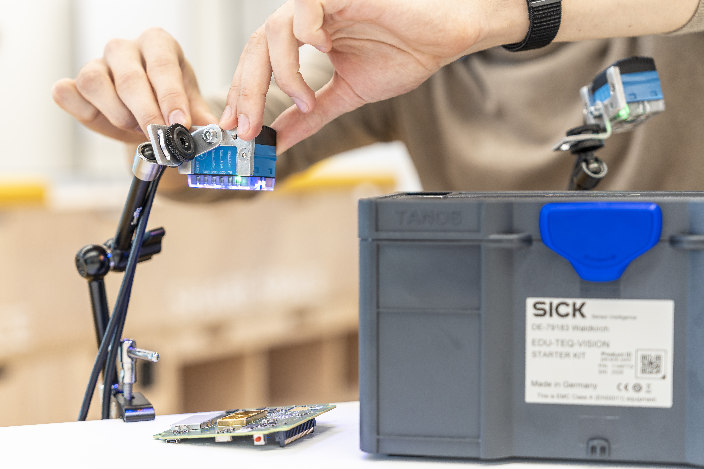

# SICK Sensor Starter Kits

Welcome to the GitHub for the SICK Sensor Starter Kits!

The Kits provide a comprehensive set of sensors, accessories and examples to help you quickly get started with SICK sensors. These kits include everything you need to explore, prototype, and integrate sensor solutions into your projects.

  

    
    
    
    
    
  

  <button class="arrow arrow-left" onclick="prevImage()">&lt;</button>
  <button class="arrow arrow-right" onclick="nextImage()">&gt;</button>

 
Don’t have a Starter Kit yet? Purchase yours here!

[start2](https://sick.com){:target="_blank".md-button}

[Subscribe to our newsletter](#){ .md-button }

**Link sick.com**

Please note that the starter kits are intended for educational purposes only and must not be used in production environments.

Got your Starter Kit(s)? Start exploring now!

- [LIDAR Starter Kit](lidar/lidar_overview.md)
- [Vision Starter Kit](vision/vision_overview.md)
- [IO Link Connectivity Starter Kit](iolink/iolink_overview.md)
