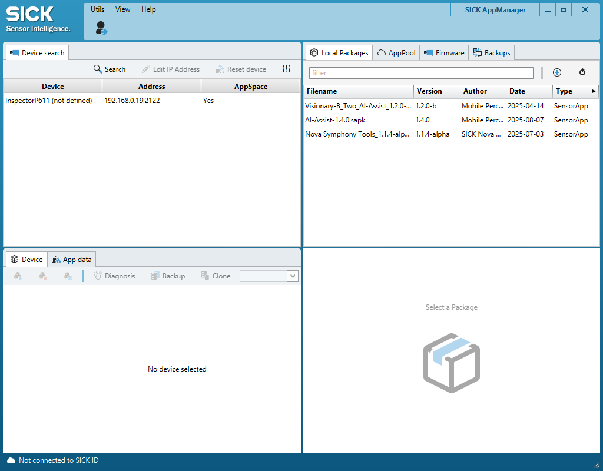
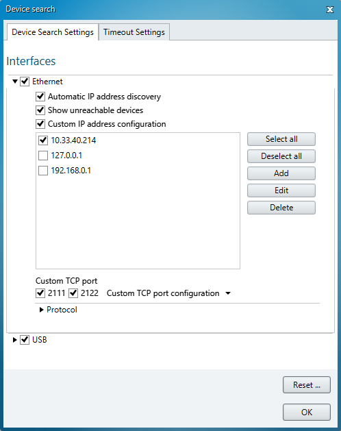

# Advanced Usage of the Vision Starter Kit

This section covers advanced features and configurations for the Vision Starter Kit.

If you want to get more information about the InspectorP61x or SICK Nova, check out the operating instructions [V2D611P-CMWBI4 - InspectorP61x | SICK](https://www.sick.com/ag/en/catalog/produkte/industrielle-bildverarbeitung-und-identifikation/industrielle-bildverarbeitung/inspectorp61x/v2d611p-cmwbi4/p/p685672?tab=downloads)

The Vision Starter Kit can also be combined with additional accessories to solve even more tasks and applications. Here's a list of useful accessories:

<table style="border-collapse: collapse; width: 100%;">
  <thead>
    <tr style="background-color: #005aff; color: white;">
      <th style="padding: 8px; text-align: left;">#</th>
      <th style="padding: 8px; text-align: left;">Article Description</th>
      <th style="padding: 8px; text-align: left;">Quantity</th>
      <th style="padding: 8px; text-align: left;">Part No.</th>
    </tr>
  </thead>
  <tbody>
    <tr>
      <td>1</td>
      <td>T-splitter – Connect an additional device for an output (e.g. signal lamp) in between power supply and InspectorP61x Please note that you need an additional power supply M12 5-pin (6075718) and adapter cable power supply 5 m (2087577) to connect the devices.</td>
      <td>1</td>
      <td>6030664</td>
    </tr>
    <tr>
      <td>2</td>
      <td>Signal light bar – Optical signal transmitter to visualize a sensor output</td>
      <td>1</td>
      <td>1114219</td>
    </tr>
    <tr>
      <td>3</td>
      <td>Photoelectric sensor – Trigger sensor for Inspector61x Please note that you need an additional IO-Link cable (2096000)</td>
      <td>1</td>
      <td>1133545</td>
    </tr>
    <tr>
      <td>4</td>
      <td>Other objects – Chocolate 3D print files: <a href="https://sick.com/de/en/downloads/media/swp682086">sick.com/de/en/downloads/media/swp682086</a> Dices Coins...</td>
      <td>-</td>
      <td>-</td>
    </tr>
  </tbody>
</table>

## Engineering Tool SICK AppManager

<strong>SICK AppManager</strong>

With the engineering tool "SICK AppManager", you can find out the IP address of your device, change it, or upgrade your firmware.

1. Download [SICK AppManager](https://www.sick.com/de/en/products/digital-services-and-software/engineering-tools/sick-appmanager/sick-appmanager/p/p532784)
2. Install and open SICK AppManager
3. Device should automatically show up in the left upper corner

4. If not: Click "Search"
5. If still not: Click on Settings icon and select all cross boxes within "Ethernet"
 
6. You can edit the IP address of the device if useful
7. Click on device to see the installed apps. Per default, the tools of SICK Nova should be pre-installed as individual apps

**Firmware Update:**

1. Go to [V2D611P-CMWBI4 - InspectorP61x | SICK](https://www.sick.com/in/en/catalog/products/machine-vision-and-identification/machine-vision/inspectorp61x/v2d611p-cmwbi4/p/p685672?category=g569793&tab=downloads) (product page > Downloads > Software) and download the latest firmware
2. Extract the .zip file to access the .spk firmware file
3. In the upper right corner of AppManager, select "Firmware"
4. Click on the "+"
5. Choose the .spk file
6. Make sure the device you want to update is selected and click on install in the bottom right corner

**Update SICK Nova**

If you want to upgrade to a newer SICK Nova version, you have two options:

1. via Apppool

## Custom Image Processing
- Use the Nova2D app to create custom image processing tasks.
- Export configurations for use in other projects.

## Integration with External Systems
- Connect the Vision Starter Kit to a PLC or other control systems.
- Use the provided API for advanced automation tasks.

## Troubleshooting
If you encounter issues, refer to the FAQ or contact SICK support.
