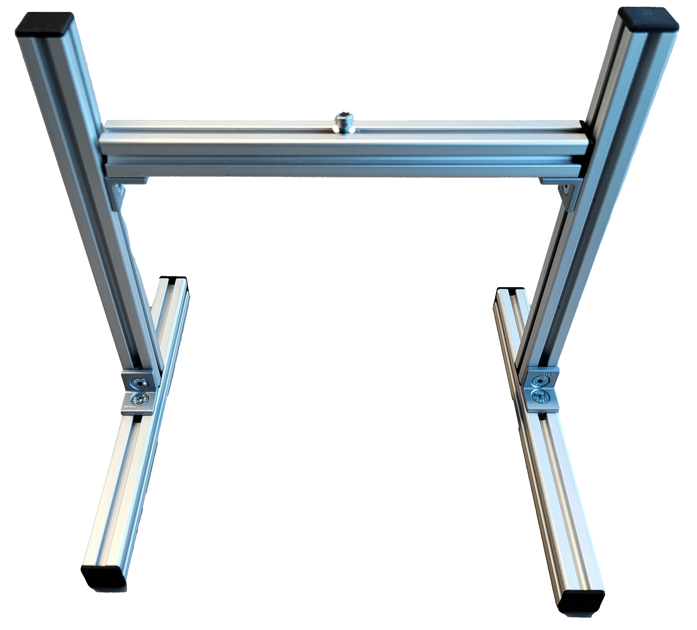

# Getting Started with the Vision Starter Kit

You are now ready to get started with the Vision Starter Kit. Follow along the instruction below **or scroll down to the tutorial video**.

**darunter alles nochmal in Textform + Bilder - ggfs. mit Aufklappern**

## Setup Vision Sensor

* Connect the Inspector with the network cable and power supply.
* Connect the network cable to the USB network adapter.
* Choose the correct plug adapter and plug the power supply into an outlet.
* Connect the USB network adapter to the PC.
* Open a browser and enter the default IP address 192.168.0.1.

## Setup Mounting Frame

**Required Hardware**

* 5 × Aluminum profiles
* 8 × End caps
* 8 × Countersunk screws
* 8 × M5 T-slot nuts
* 1 × M4 T-slot nut
* 4 × Angle brackets
* 1 × Hex key (3 mm)**

**Top Bar**

* Take one aluminum profile from the box.
* Insert one M4 T-slot nut into the top groove.
* Insert two M5 T-slot nuts into the bottom groove (opposite side of the M4 nut).
* Attach two angle brackets using countersunk screws and tighten them into the M5 T-slot nuts with a hex key.
* Place end caps on both ends of the profile.
* Slide the angle brackets to both ends of the profile and tighten the screws so that the angle brackets and end caps are aligned.

**Bottom Bars (x2)**

* Insert one M5 T-slot nut into the center groove of each bar.
* Attach one angle bracket with countersunk screws and tighten using the hex key.
* Place end caps on both ends.
* Position both profiles parallel in front of you, oriented lengthwise, so the ends point toward you and away from you—not sideways across the table.

**Vertical Bars (x2)**

* Insert one M5 T-slot nut at the bottom end of each bar.
* Mount each vertical bar at a 90° angle to one bottom bar using a countersunk screw and a 3 mm hex key.
* Insert one M5 T-slot nut at the top end of each bar in the groove facing the other bottom bar.
* Place an end cap on the top of each vertical bar.
Use the two remaining countersunk screws to mount the top bar between the two vertical bars with the angle brackets and hex key.
* Tip: It may be easier to lay the frame down to mount the top bar.
* Adjust the height and angle of the top bar by loosening and tightening the two inner screws at the top of the vertical bars.

**Final Step**

* Mount the Inspector61x bracket using the supplied M4 screw and washer to the T-slot nut on top of the top bar.

**Now you are ready start, feel free to try out or choose an [example project](./vision_example_projects.md) or code [snippets](./vision_code_snippets.md) or check out [training materials] (./vision_training_material.md) from below**

<strong>Troubleshooting</strong>

1. If you can't connect to the sensor, check if the LED **"Ready"** is green.  
   If not, the power supply is not correctly established. Wait up to 2 minutes and check if the power supply is connected correctly.

2. If you still can’t connect to the device, try changing the IP address of the adapter:  
   - Open your operating system's network settings (e.g., **Control Panel > Network & Internet** in Windows 10/11, or the equivalent in your OS).  
   - Choose **Advanced network settings**  
   - Identify the USB Ethernet adapter (might be listed as **ASIX USB to Gigabit Ethernet Family Adapter**).  
   - Click on the adapter and select **Properties / Edit**.  
   - Enter administrator credentials if necessary.  
   - Configure IP Settings:  
     - Locate **Internet Protocol Version 4 (TCP/IPv4)** and select **Properties**.  
     - Change from DHCP to manual IP settings.  
     - Use the following IP address: `192.168.0.xxx`  
     - Subnet mask: `255.255.0.0`  
     - Save changes and restart your computer or adapter if needed.

3. If you still can’t connect, look up the device IP address via **SICK AppManager**:  
   [SICK AppManager | SICK](https://www.sick.com/ag/en/catalog/products/machine-vision-and-identification/machine-vision/inspectorp61x/c/g555810)  
   Go to the **Advanced section** for details.

4. If you are already connected and using AI tools:  
   - The device has a trial license. After 2 hours, restart the device to reset the timer.  
   - Unplug and plug in again. Save configuration beforehand.

5. Check the **FAQ section**: [FAQ Link](https://www.sick.com)

6. If the device still has issues:  
   - Go to the **Support Portal**, register, and create a case to get assistance.

**Tutorial zu Setup (mechanical setup, electrical connection, mounting frame)**

**If you want to learn more about the device or Nova, check out this video**

